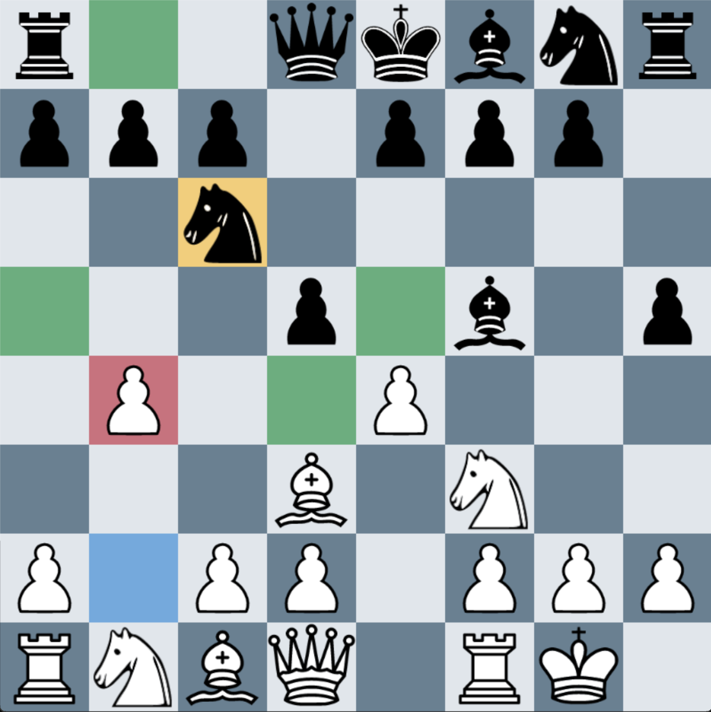
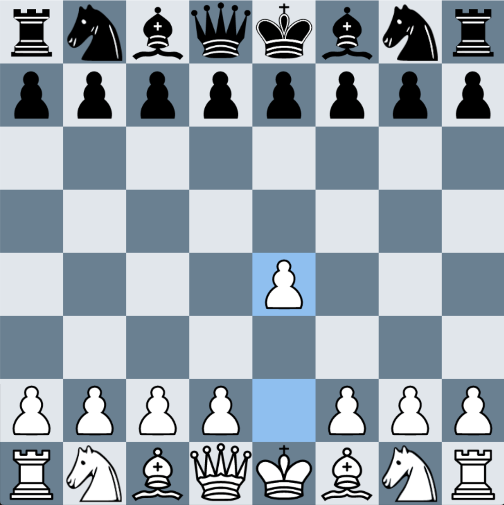
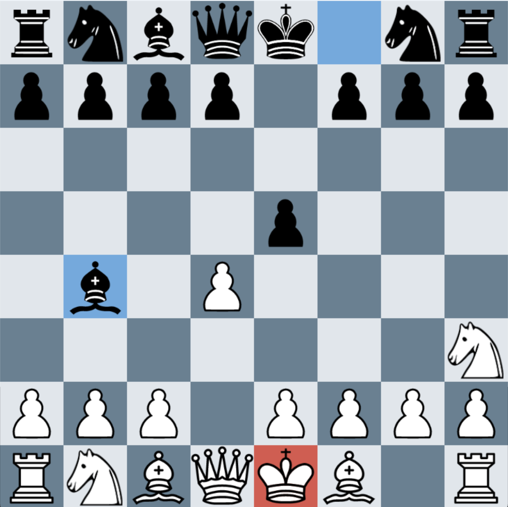
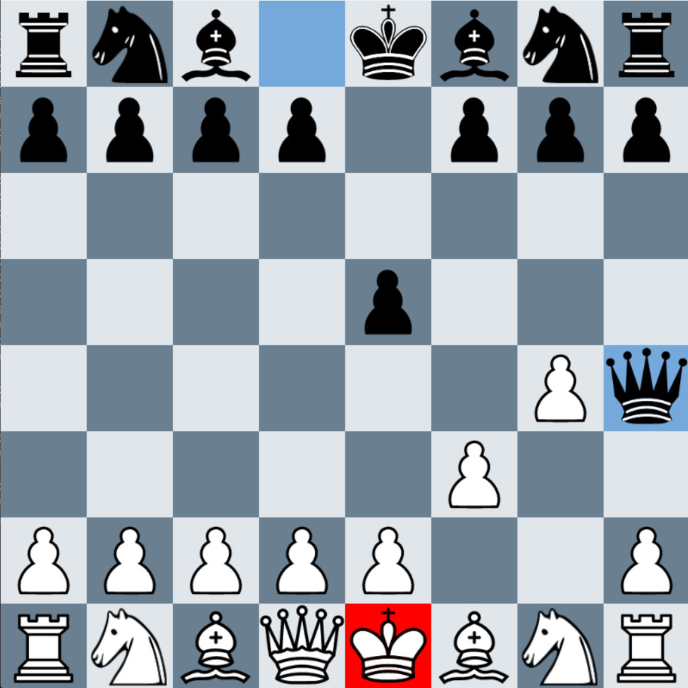
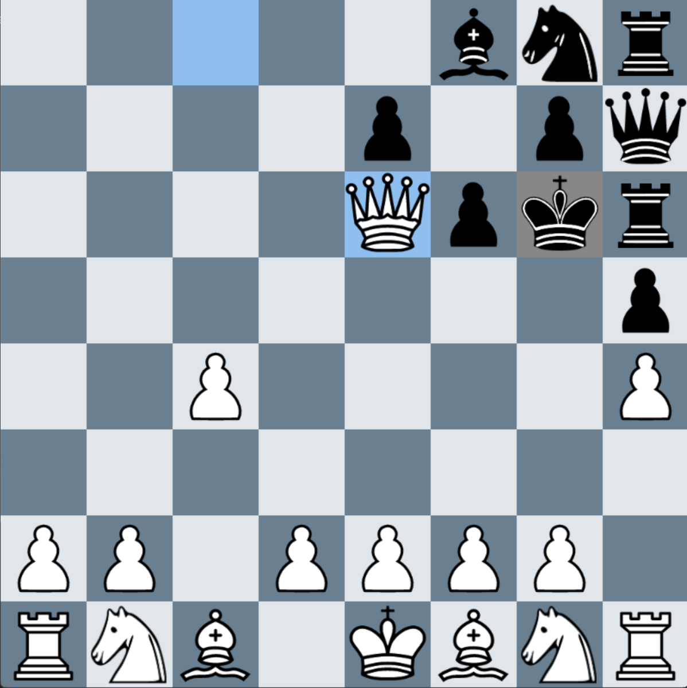

# Chess
This is my chess game coded in Rust. 
To run the game, make sure all files here are in the same folder. And first run cargo build to build the project, and anytime you want to play the game just run cargo run.  
These commands should be run from the root of the directory/folder containing the files in this repo.  

Note: The chess pieces I used for this game were open source and free to use, I got them from this repo: https://github.com/samboy/ChessGraphics

I will now go over the highlighting conventions I used in the game:

Here the selected piece by the player is highlighted in gold  
The green tiles represent where the piece can move to
The red tile represents that moving to that tile will take the enemies piece  

Here after moving a piece, the moved piece will be highlighted in blue, and the tile it moved from will also be highlighted in blue  

When a king get checked, it will be highlighted by a muted red color

When a king get checkmated, it will be highlighted by a strong red color instead, and also mouse input will be disabled

  
When a stalemate occurs, the kings who is in stalemate will be highlighted a grey color
